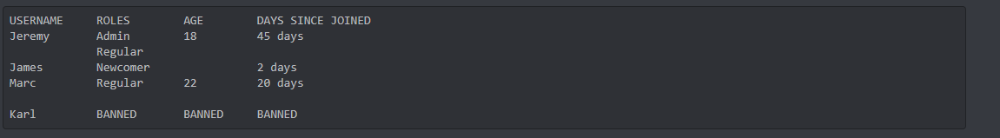

# discord-table


[](https://travis-ci.com/hugop95/discord-table)

Discord Table is a very simple package to build Markdown tables through the Discord API.
Taking some formatting parameters, it returns a ```string[]``` object, usable with the Discord API
to print a table.

## Usage

The content of the table is an Array of lines.

A line is an Array of cells.

A cell is an Array of sub-cells.

### Javascript import
```js
const dcTable = require('@hugop/discord-table')
```

### TypeScript import
``` typescript
import {createDiscordTable} from "@hugop/discord-table";
```

### Basic usage

```js
 const headers = [
  ["USERNAME"], ["ROLES"], ["AGE"], ["DAYS SINCE JOINED"]
];
const content = [
  [["Jeremy"], ["Admin", "Regular"], ["18"], ["45 days"]],
  [["James"], ["Newcomer"], [], ["2 days"]],
  [["Marc"], ["Regular"], ["22"], ["20 days"]],
  [],
  [["Karl"], ["BANNED"], ["BANNED"], ["BANNED"]]
]
const result = dcTable.createDiscordTable({
  headers: headers,
  content: content,
  spacesBetweenColumns: [5, 5, 5],
  maxColumnLengths: [30, 30, 30, 30]
})
```

### Result on Discord



## Installation

[npm link](https://www.npmjs.com/package/@hugop/discord-table)

This is a [Node.js](https://nodejs.org/en/) module available through the
[npm registry](https://www.npmjs.com/).

Installation:
```bash
$ npm install @hugop/discord-table
```

## Features

* Customizable maximum column length for each column
* Customizable space between each column
* Multi-line cells

## Notes
* You are responsible for ensuring that the resulting object fits the Discord API limitations 
(such as maximum length authorized per message).
* The maximum width allowed by the table before a line wraps to another line depends on the client's screen width.
You might need to adjust column lengths and space between columns to ensure that most users can see each line properly.
* Some Emojis and special characters that are full width may shift how columns appear
